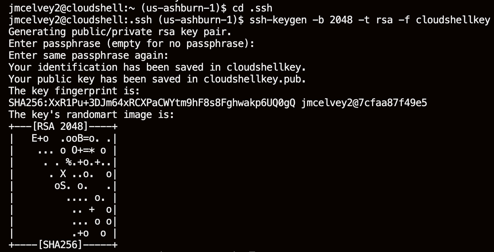

# Create SSH Keys Using Oracle Cloud Shell

## Introduction

The SSH (Secure Shell) protocol is a method for secure remote login from one computer to another. SSH enables secure system administration and file transfers over insecure networks using encryption to secure the connections between endpoints. SSH keys are an important part of securely accessing Oracle Cloud Infrastructure compute instances in the cloud.

We recommend you use the *Oracle Cloud Shell* to interface with the OCI compute instance you will create. Oracle Cloud Shell is browser-based, does not require installation or configuration of software on your laptop, and works independently of your network setup.

*IMPORTANT:  If the SSH key is not created correctly, you will not be able to connect to your environment and will get errors.  Please ensure you create your key properly.*

Watch the video below for an overview of the lab.
[](youtube:oq2Hk1Yy9Cg)


## Oracle Cloud Shell

The Cloud Shell machine is a small virtual machine running a Bash shell which you access through the OCI Console (Homepage). Cloud Shell comes with a pre-authenticated OCI CLI (Command Line Interface), set to the Console tenancy home page region, as well as up-to-date tools and utilities. To use the Cloud Shell machine, your tenancy administrator must grant the required IAM (Identity and Access Management) policy.

1.  To start the Oracle Cloud shell, go to your Cloud console and click the cloud shell icon at the top right of the page.

    

    

    

2.  Once the cloud shell has started, enter the following commands. Choose the key name you can remember. This will be the keyname you will use to connect to any compute instances you create. Press Enter twice for no passphrase.

    ````
    <copy>mkdir .ssh</copy>
    ````
     

    ````
    <copy>cd .ssh</copy>
    ````

    ````
    ssh-keygen -b 2048 -t rsa -f <<sshkeyname>>
    ````

    *Note: The angle brackets <<>> should not appear in your code.*

    


3.  Examine the two files that you just created.

    ````
    <copy>ls</copy>
    ````

    

    Note in the output that there are two files, a *private key:* ```<<sshkeyname>>``` and a *public key:* ```<<sshkeyname>>.pub```. Keep the private key safe and don't share its content with anyone. The public key will be needed for various activities and can be uploaded to certain systems as well as copied and pasted to facilitate secure communications in the cloud.

4. To list the contents of the public key, use the cat command:
     ```
     cat <<sshkeyname>>.pub
     ```

    *Note: The angle brackets <<>> should not appear in your code.*

    

5.  Copy the contents of the public key and save it somewhere for later. When pasting the key into the compute instance in future labs, make sure that you remove any hard returns that may have been added when copying. *The .pub key should be one line.*

    

You may now [proceed to the next lab](#next).

## Acknowledgements
* **Author** - Dan Kingsley, Enablement Specialist, OSPA
* **Last Updated By/Date** - Kamryn Vinson Database Product Management, January 2021
* **Workshop (or Lab) Expiry Date** - March 27, 2021

## Need Help?

Please submit feedback or ask for help by sending an email to livelabs-help-db_us@oracle.com. Please make sure to include your workshop name and lab name.  You can also include screenshots and attach files.
