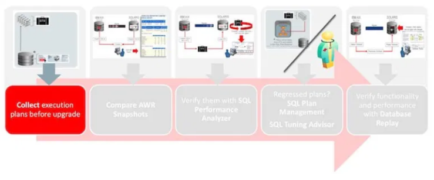
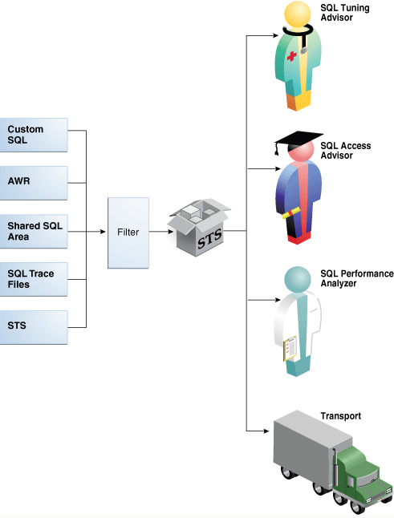

# Capture and Preserve SQL

## Introduction

In this lab you will capture and preserve SQL statements and information as well as the AWR. We’ll use this collection later on following a performance stability method guideline.



Estimated Lab Time: n minutes

### About SQL Tuning Sets
A SQL tuning set (STS) is a database object that you can use as input to tuning tools. The database stores SQL tuning sets in a database-provided schema. An STS includes:

- A set of SQL statements
- Associated execution context, such as user schema, application module name and action, list of bind values, and the environment for SQL compilation of the cursor
- Associated basic execution statistics, such as elapsed time, CPU time, buffer gets, disk reads, rows processed, cursor fetches, the number of executions, the number of complete executions, optimizer cost, and the command type
- Associated execution plans and row source statistics for each SQL statement (optional)

An STS allows you to transport SQL between databases.  You can export SQL tuning sets from one database to another, enabling transfer of SQL workloads between databases for remote performance diagnostics and tuning. When suboptimally performing SQL statements occur on a production database, developers may not want to investigate and tune directly on the production database. The DBA can transport the problematic SQL statements to a test database where the developers can safely analyze and tune them.



### Objectives
In this lab, you will:
* Collect Statements from AWR
* Collect Statements from Cursor Cache
* Optional - Export AWR

### Prerequisites

* An Oracle Free Tier, Always Free, Paid or LiveLabs Cloud Account

## **STEP 1**: Collect Statements from AWR

In order to collect SQL Statements directly from AWR (Automatic Workload Repository) you’ll call a SQL script which:
- Creates a SQL Tuning Set (STS)
- Populates the STS with SQL information stored in AWR

1.  Login to Oracle Cloud
2.  Run the script stored in /home/oracle/scripts:

    ````
    <copy>
    capture_awr.sql
    </copy>
    ````

3. In your open SQL*plus session connected to UPGR run the statement below.  The number of statements in SQL Tuning Set “STS_CaptureAWR” will be displayed.


    ````
    <copy>
    @/home/oracle/scripts/capture_awr.sql
    </copy>
    ````

## **STEP 2**: Collect Statements from Cursor Cache

You can also collect statements directly from the Cursor Cache. This is more resource intense but helpful in case of OLTP applications. Be careful when you poll the cursor cache too frequently.

This procedure:

- Creates a SQL Tuning Set (STS)
- Populates the STS with SQL statements/information from the cursor cache
- It will poll the cursor cache for 240 seconds every 10 seconds

The script is stored in /home/oracle/scripts:

    capture_cc.sql

You used it already when you ran HammerDB in the earlier lab.
Hence, no need to run it again.

@/home/oracle/scripts/capture_cc.sql —don’t run it again!!!

The number of statements in SQL Tuning Set “STS_CaptureCursorCache” will be displayed.

But now check, how many statements you’ve collected in each SQL Tuning Set:

select name, owner, statement_count from dba_sqlset;

## **STEP 3**: Optional - Export AWR

Especially when you migrate databases, exporting and preserving the AWR is important. When you upgrade, the AWR will stay in the database. This exercise is only done for protection but not necessary for the flow of the lab.

1. Export the AWR by running the sql stored in your Oracle home.

    ````
    <copy>
    @?/rdbms/admin/awrextr.sql
    </copy>
    ````

    ````
    Databases in this Workload Repository schema
    ~~~~~~~~~~~~~~~~~~~~~~~~~~~~~~~~~~~~~~~~~~~~

    DB Id     DB Name	  Host
    ------------ ------------ ------------
    * 72245725   UPGR	  localhost.lo
                caldomain


    The default database id is the local one: '72245725'.  To use this
    database id, press  to continue, otherwise enter an alternative.

    Enter value for dbid:
    ````

2. Hit RETURN.

    ````
    Using 72245725 for Database ID


    Specify the number of days of snapshots to choose from
    ~~~~~~~~~~~~~~~~~~~~~~~~~~~~~~~~~~~~~~~~~~~~~~~~~~~~~~
    Entering the number of days (n) will result in the most recent
    (n) days of snapshots being listed.  Pressing  without
    specifying a number lists all completed snapshots.


    Enter value for num_days:
    ````

3. Type: 2. Hit RETURN.

    ````
    Enter value for num_days: 2

    Listing the last 2 days of Completed Snapshots

    DB Name        Snap Id	  Snap Started
    ------------ --------- ------------------
    UPGR		   110 20 Feb 2020 22:12
            111 20 Feb 2020 22:39
            112 20 Feb 2020 22:40


    Specify the Begin and End Snapshot Ids
    ~~~~~~~~~~~~~~~~~~~~~~~~~~~~~~~~~~~~~~
    Enter value for begin_snap:
    ````

4. Type: 110 <= Your snapshot number may be different.  Hit RETURN.

    ````
    Specify the Begin and End Snapshot Ids
    ~~~~~~~~~~~~~~~~~~~~~~~~~~~~~~~~~~~~~~
    Enter value for begin_snap: 110
    Begin Snapshot Id specified: 110

    Enter value for end_snap:
    ````

5. Type: 112 <= Your snapshot number may be different.  Hit RETURN.

    ````
    End   Snapshot Id specified: 112

    Specify the Directory Name
    ~~~~~~~~~~~~~~~~~~~~~~~~~~

    Directory Name		       Directory Path
    ------------------------------ -------------------------------------------------
    DATA_PUMP_DIR		       /u01/app/oracle/admin/UPGR/dpdump/
    ORACLE_OCM_CONFIG_DIR	       /u01/app/oracle/product/11.2.0.4/ccr/hosts/localhost.localdomain/state
    ORACLE_OCM_CONFIG_DIR2	       /u01/app/oracle/product/11.2.0.4/ccr/state
    PREUPGRADE_DIR		       /u01/app/oracle/cfgtoollogs/UPGR/preupgrade
    XMLDIR			       /u01/app/oracle/product/11.2.0.4/rdbms/xml


    Choose a Directory Name from the above list (case-sensitive).

    Enter value for directory_name:
    ````

6. Type: DATA_PUMP_DIR.  Hit RETURN

    ````
    Enter value for directory_name: DATA_PUMP_DIR

    Using the dump directory: DATA_PUMP_DIR

    Specify the Name of the Extract Dump File
    ~~~~~~~~~~~~~~~~~~~~~~~~~~~~~~~~~~~~~~~~~
    The prefix for the default dump file name is awrdat_64_71.
    To use this name, press  to continue, otherwise enter
    an alternative.

    Enter value for file_name:

    Hit RETURN
    ````

    ````    
    Using the dump file prefix: awrdat_64_71
    |
    | ~~~~~~~~~~~~~~~~~~~~~~~~~~~~~~~~~~~~~~~~~~~~~
    |  The AWR extract dump file will be located
    |  in the following directory/file:
    |   /u01/app/oracle/product/UPGR/dpdump/
    |   awrdat_110_112.dmp
    | ~~~~~~~~~~~~~~~~~~~~~~~~~~~~~~~~~~~~~~~~~~~~~
    |
    |  *** AWR Extract Started ...
    |
    |  This operation will take a few moments. The
    |  progress of the AWR extract operation can be
    |  monitored in the following directory/file:
    |   /u01/app/oracle/product/UPGR/dpdump/
    |   awrdat_110_112.log 
    | End of AWR Extract

    This will take now a few minutes.
    ````

7. Exit from SQL*Plus

    ````
    exit
    ````

You may now [proceed to the next lab](#next).

## Learn More

* [SQL Tuning Sets](https://docs.oracle.com/en/database/oracle/oracle-database/19/tgsql/managing-sql-tuning-sets.html#GUID-DD136837-9921-4C73-ABB8-9F1DC22542C5)

## Acknowledgements
* **Author** - Mike Dietrich, Database Product Management
* **Contributors** -  Roy Swonger, Database Product Management
* **Last Updated By/Date** - Kay Malcolm, February 2021

## Need Help?
Please submit feedback or ask for help using our [LiveLabs Support Forum](https://community.oracle.com/tech/developers/categories/livelabsdiscussions). Please click the **Log In** button and login using your Oracle Account. Click the **Ask A Question** button to the left to start a *New Discussion* or *Ask a Question*.  Please include your workshop name and lab name.  You can also include screenshots and attach files.  Engage directly with the author of the workshop.

If you do not have an Oracle Account, click [here](https://profile.oracle.com/myprofile/account/create-account.jspx) to create one.
