## Purpose

This tutorial covers the use of Oracle Data Miner to perform data mining against Oracle Database 19c. In this workshop, you examine and solve a data mining business problem by using the Oracle Data Miner graphical user interface (GUI). The Oracle Data Miner GUI is included as an extension of Oracle SQL Developer, version 19.2.1.247.

Oracle SQL Developer is a free graphical tool for database development. With SQL Developer, you can browse database objects, run SQL statements and SQL scripts, and edit and debug PL/SQL statements. Starting with SQL Developer, version 3.0, you can also access the Oracle Data Miner GUI, which provides a tightly integrated interface to Oracle Data Mining features.

*Estimated Lab Time:* 30 Minutes

## Overview

Data mining is the process of extracting useful information from masses of data by extracting patterns and trends from the data. Data mining can be used to solve many kinds of business problems, including:
- Predict individual behavior, for example, the customers likely to respond to a promotional offer or the customers likely to buy a specific product (Classification)
- Find profiles of targeted people or items (Classification using Decision Trees)
- Find natural segments or clusters (Clustering)
- Identify factors more associated with a target attribute (Attribute Importance)
- Find co-occurring events or purchases (Associations, sometimes known as Market Basket Analysis)

### **Problem Definition and Business Goals**
When performing data mining, the business problem must be well-defined and stated in terms of data mining functionality. For example, retail businesses, telephone companies, financial institutions, and other types of enterprises are interested in customer “segmentation” – that is, the act of dividing a customer base into groups of individuals that are similar in specific ways relevant to marketing, such as age, gender, interests and spending habits.

The statement “I want to use data mining to study the retail data” is much too vague. From a business point of view, we need specific questions that needs to be answered from the data available to us. The questions must be relevant to the business and should be able to positively influence the business revenues or returns. 
This is a transactional level data set, which contains all the transactions occurring between 01/12/2018 and 09/12/2019 for a US-based retail store.

Data is stored in multiple sources (RDBMS, XML and JSON) and we need to combine them into a single data source (CSV) to gather the insights
The company mainly sells unique all-occasion gifts.
Many customers of the company are wholesalers.
Prerequisites

### **Before starting this tutorial, you should:**

1.	Have access to or have Installed Oracle Database 19c Enterprise Edition High Performance, Release 19.8.0.0.0 with Data Mining Option.
 
2.	Have access to or have installed Oracle SQL Developer, version 3.0, or later.
Note: SQL Developer does not have an installer. To install SQL Developer, just unzip the free SQL Developer download to any directory on your PC.
 
3.	Have set up Oracle Data Miner 19c for use within Oracle SQL Developer.
Note: If you have not already set up Oracle Data Miner, complete the following lesson: Setting Up Oracle Data Miner 19c Release 2.

**Create a Data Miner Project**

Before you create a Data Miner Project and build a Data Miner workflow, it is helpful to examine some of the Data Miner interface components within SQL Developer. You can then structure your working environment to provide simplified access to the necessary Data Miner features.

Identifying SQL Developer and Data Miner Interface Components
After setting up Oracle Data Miner for use within SQL Developer, different interface elements may be displayed, including both SQL Developer and Data Miner components.

In the following example, several display elements are open, including the:
-	The SQL Developer Connections tabs
-	The SQL Developer Reports tabs
-	The Data Miner tab

  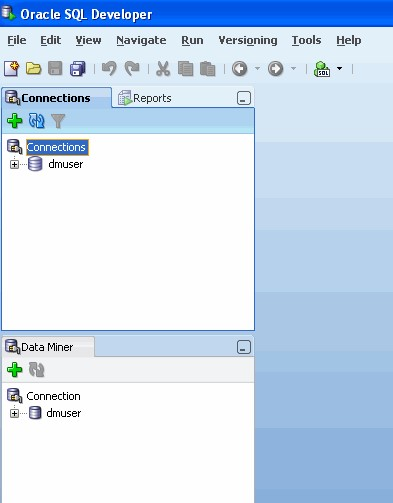
 
***Notes:***
- The layout and contents of your SQL Developer window may be different than the example shown above.
- SQL Developer and Data Miner interface elements open automatically when needed.
- Additional Data Miner interface elements include the Workflow Jobs, Property Inspector, Component Palette, and Thumbnail tabs. You can open any one them manually from the main menu by using **View > Data Miner** > as shown here:

 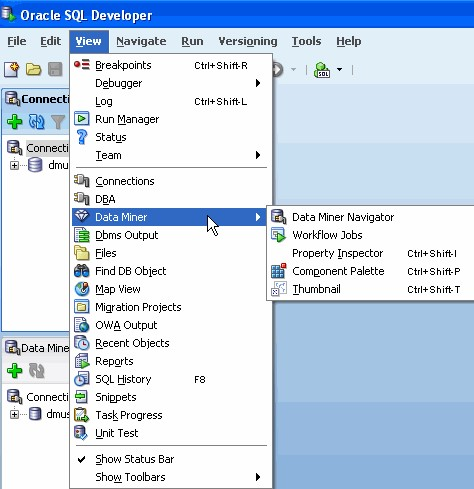

In order to simplify the interface for Data Mining development, you can dismiss the SQL Developer specific interface elements by clicking on the respective Close [x] icons for each tab or window.
For example, close both of the SQL Developer tabs mentioned above:
1.	SQL Developer Reports tab
2.	SQL Developer Connections tab

 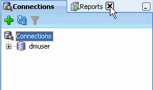

 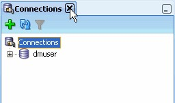

Now, the SQL Developer interface should look like this:

 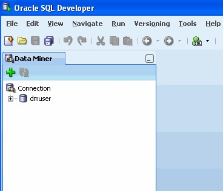
 
**DataMiner > Workflow Jobs.**

***Note:***
 ***You can re-open the SQL Developer Connections tab (and other interface elements) at any time by using the View menu.***

## **Step 1**: Start creating a Data Miner Project

Before you begin working on a Data Miner Workflow, you must create a Data Miner Project, which serves as a container for one or more Workflows.

In the tutorial Setting Up **Oracle Data Miner 11g Release 2**, you learned how to create a database account and SQL Developer connection for a data mining user named dmuser. This user has access to the sample data that you will be mining.

***Note: If you have not yet set up Oracle Data Miner, or have not created the data mining user, you must first complete the tasks presented in the tutorial Setting Up Oracle Data Miner 19c Release 2,***

To create a Data Miner Project, perform the following steps:

1.	In the Data Miner tab, right-click the data mining user connection that you previously created, and select **New Project**, as shown here:

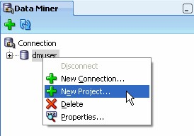 
 
2.	In the Create Project window, enter a project name (in this example Clustering) and then **click OK**.

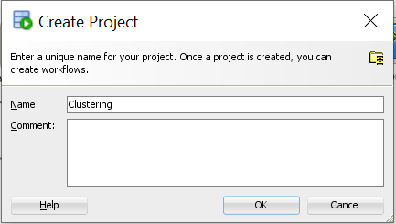
 
***Note: You may optionally enter a comment that describes the intentions for this project. This description can be modified at any time.***

**Result:** The new project appears below the data mining user connection node.

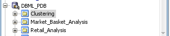
  
 
**Build a Data Miner Workflow**

A Data Miner Workflow is a collection of connected nodes that describe a data mining processes.

A workflow:
- Provides directions for the Data Mining server. For example, the workflow says, "Build a model with these characteristics." The data-mining server builds the model with the results returned to the workflow.
- Enables you to interactively build, analyze, and test a data mining process within a graphical environment.
- Might be used to test and analyze only one cycle within a particular phase of a larger process, or it may encapsulate all phases of a process designed to solve a particular business problem.
  
What Does a Data Miner Workflow Contain?

Visually, the workflow window serves as a canvas on which you build the graphical representation of a data mining process flow, like the one shown here:

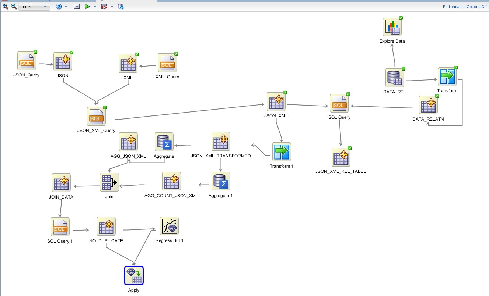

***Notes:***
  - Each element in the process is represented by a graphical icon called a node.
  - Each node has a specific purpose, contains specific instructions, and may be modified individually in numerous ways.
  - When linked together, workflow nodes construct the modeling process by which your particular data mining problem is solved.
  
As you will learn, any node may be added to a workflow by simply dragging and dropping it onto the workflow area. Each node contains a set of default properties. You modify the properties as desired until you are ready to move onto the next step in the process.

## **Step 2**: Sample Data Mining Scenario

In this topic, you will create a data mining process that groups customers into clusters based on their attributes like items purchased, spending, location etc. This technique is called Clustering. Typically clustering is used in customer segmentation analysis to try an better understand what type of customers you have.

Like with all data mining techniques, Clustering will not tell you or give you some magic insight into your data. Instead, it gives you more information for you to interpret and add the business meaning to them. With Clustering, you can explore the data that forms each cluster to understand what it really means.
To accomplish this goal, you build a workflow that enables you to:

- Build and compare several Clustering models
- Select and run the models that produce the most actionable results
  
To create the workflow for this process, perform the following steps.

## **Step 3**: Create a Workflow and Add data for the workflow

1.	Right-click your project (Retail\_Data\_Analysis) and select New Workflow from the menu.

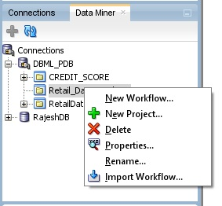
 
Result: The Create Workflow window appears.
 
2.	In the Create Workflow window, enter Predicting\_Customer\_Value as the name and click OK.

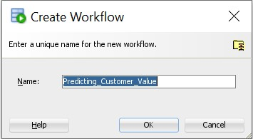
 
Result:
- In the middle of the SQL Developer window, an empty workflow canvas opens with the name that you specified.
- On the right-hand side of the interface, the Component Palette tab of the Workflow Editor appears (shown below with a red border).
- In addition, three other Oracle Data Miner interface elements are opened:
    - The Thumbnail tab
    - The Workflow Jobs tab
    - The Property Inspector tab

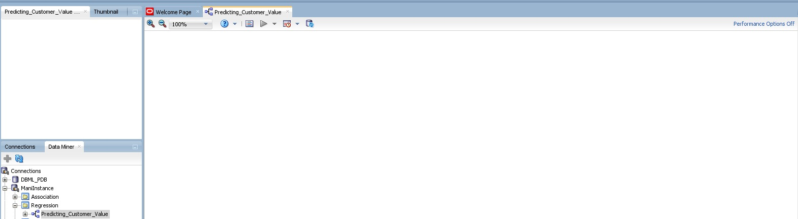

3.	The first element of any workflow is the source data. We will extract data from a JSON table and a XM table. Here, we cannot directly add a data source. We will use a query editor to read the tables in a relational table format. You add a Data Source node to the workflow, and select the JSON\_PURCHASEORDER and XML\_PURCHASEORDER tables as the data source.

In the Component Palette, click the Data category. A list of data nodes appear, as shown here:

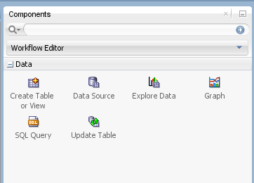

4. Defining the data we will used to Build our Cluster models

We are going to divide the data in our FINAL\_JSON\_XML\_DATA into two data sets. The first data set will be used to build the Cluster models. The second data set will be used as part of the Apply node.

To divide the data we are going to use the Sample Node that can be found under the Transformation tab of the Component Palette.

Create your first Sample Node.
Drag a sample node into the workflow and connect it with the data node.

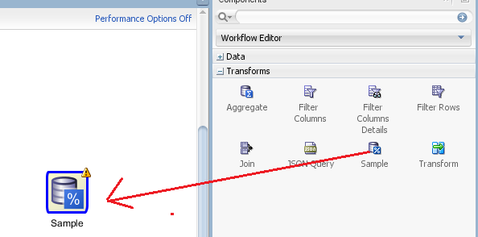 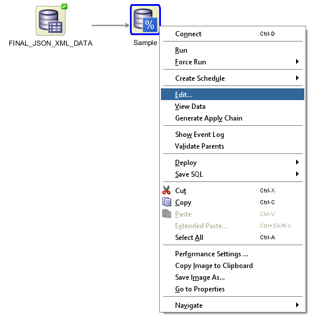
     
In the Settings tab of the Property Inspector set the sample size to 60% and in the Details tab rename the node to Sample Build. Select the Case ID a CUSTOMERID.

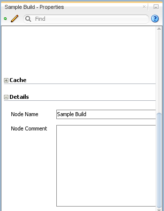 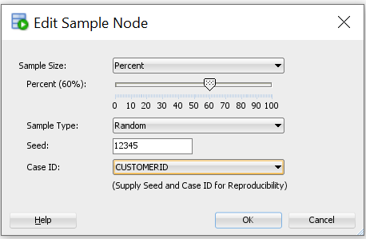
     
Create a second Sample node and give it a sample size of 40%. Rename this node to Sample Apply. Select CUSTOMERID as Case ID.

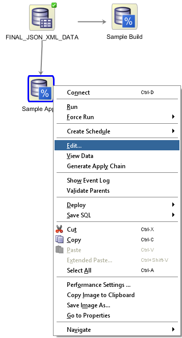 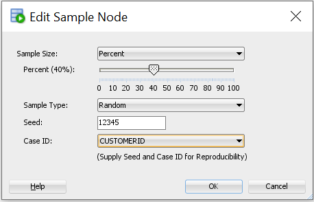
                
Right click on each of these Sample nodes to run them and have them ready for the next step of building the Clustering models.
                                          
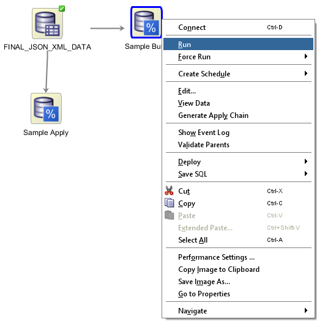 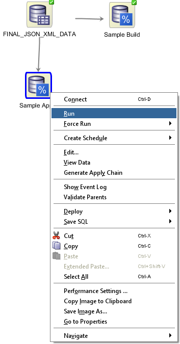 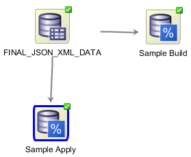

5. Save the workflow by clicking the Save All icon in main toolbar.
 
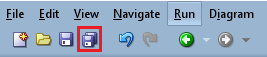

## **Step 4:** Build the Models

In this topic, you build the selected models against the source data. This operation is also called “training” a model, and the model is said to “learn” from the training data.

A common data mining practice is to build (or train) your model against part of the source data, and then to test the model against the remaining portion of your data. By default, Oracle Data Miner this approach.
The models have the same build data and the same target.

By default, the models are all tested. The test data is created by randomly splitting the build data into a build data set and a test data set. The default ratio for the split is 60 percent build and 40 percent test. When possible Data Miner uses compression when creating the test and build data sets.

To create the Clustering models, go to the Component Palette. Under the Models tab, select **Clustering**.
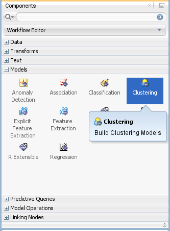
 
Move the mouse to the workflow worksheet, near the **FINAL\_JSON\_XML\_DATA** node and click the worksheet. The Clustering node will be created. Now we need to connect the data with the Clustering node. To do this right click on the **Sample Build** node and select **Connect** from the drop down list. Then move the mouse to the Clustering node and click. An arrowed line is created connecting the two nodes.
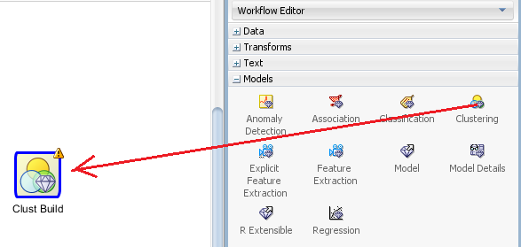 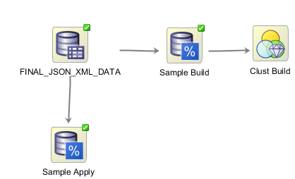
       
At this point, we can run the Clustering Build node or we can have a look at the setting for each algorithm.

**The Clustering Algorithm settings**

To setup the Cluster Build node you will need to double click on the node to open the properties window. The first thing that you need to do is to specify the Case ID (i.e. the primary key). In our example, this is the **CUSTOMERID**.
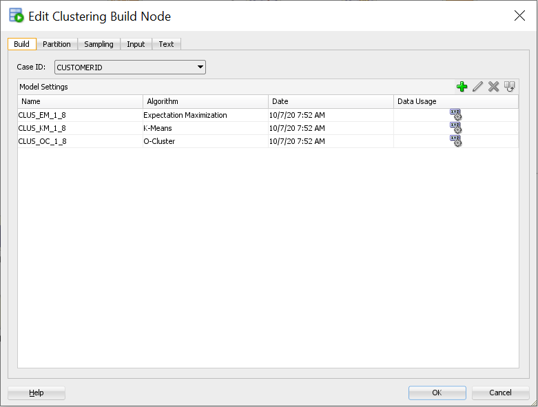

Oracle Data Miner has three clustering algorithms. The first of these is the **expectation-maximization** clustering, the second clustering algorithm is the well know **k-Means** (it is an enhanced version of it) and the third is O-Cluster. To look at the settings for each algorithm, click on the model listed under Model Settings and then click on the **Edit Advanced** icon as shown below.
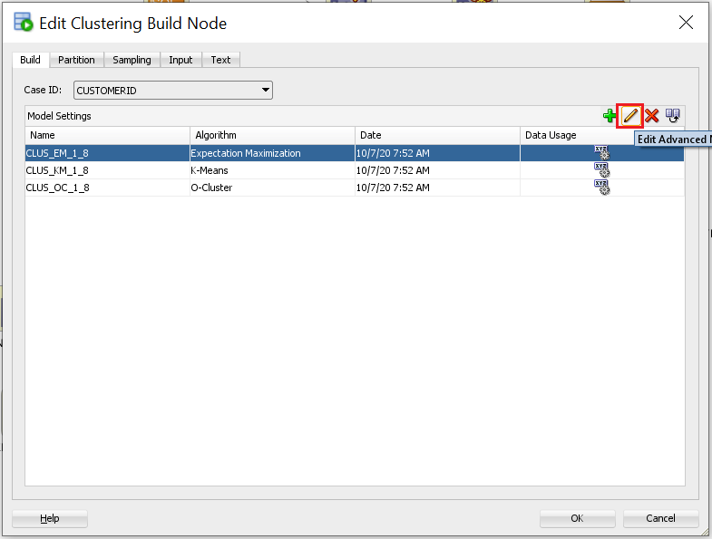 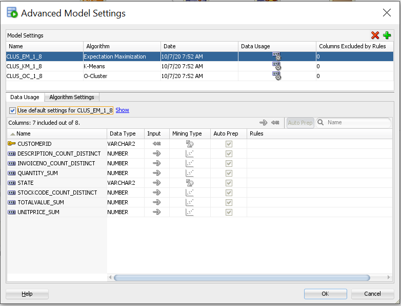

A new window will open that lists all the attributes for the in the data source. The CUSTOMERID is unchecked as we said that this was the CASE_ID.

Click on the Algorithm Settings tab to see the internal settings for the **k-means algorithm**. All of these settings have a default value. Oracle has worked out what the optimal setting are for you. The main setting that you might want to play with is the Number of Clusters to build. The default is 10, but you might want to play with numbers between 5 and 15 depending on the number of clusters or segments you want to see in your data.

To view the algorithm settings for **O-Cluster** or **EM Cluster** click on this under the Model Setting. We have less internal settings to worry about here, but we again can determine how many clusters we want to produce.

For our scenario, we are going to take the default settings.
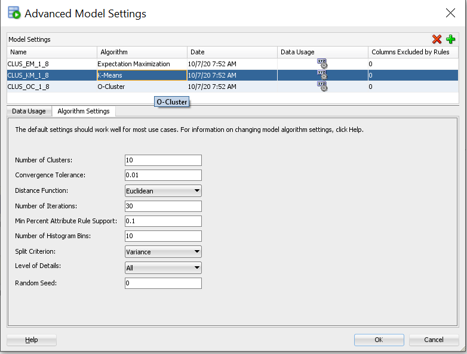

**Run/Generate the Clustering models**

At this stage we have the data set-up, the Cluster Build node created and the algorithm setting all set to what we want.

Now we are ready to run the Cluster Build node.

To do this, right click on the Cluster Build node and click run. ODM will go create a job that will contain PL/SQL code that will generate a cluster model based on K-Means and a second cluster model based on O-Cluster. This job is submitted to the database and when it is complete, we will get the little green tick mark on the top right hand corner of the Cluster Build node.
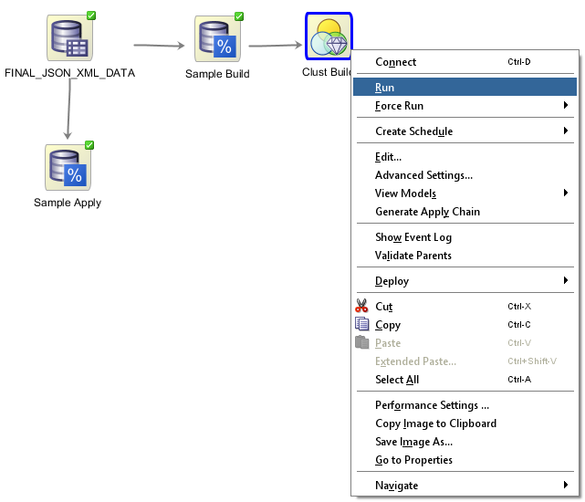 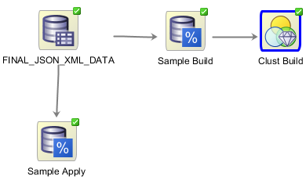
               
## **Step 5:** View the Cluster Models
To view the the cluster modes we need to right click the Cluster Build node and select View Models from the drop down list. We get an additional down down menu that gives the names of the three cluster models that were developed.

In my case, these are **CLUS\_EM_1\_8, CLUS\_KM\_1\_8 and CLUS\_OC\_1\_8**. You may get different numbers on your model names. These numbers are generated internally in ODM
The first one that we will look at will be the K-Mean Cluster Model (**CLUS\_KM\_1\_8**). 

Select this from the menu.
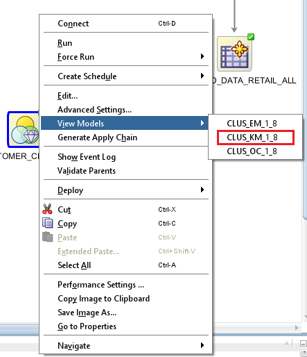
 
## **Step 6:** View the Cluster Rules
The hierarchical K-Mean cluster mode will be displayed. You might need to readjust/resize some of the worksheets/message panes etc in ODM to get the good portion of the diagram to display.
    
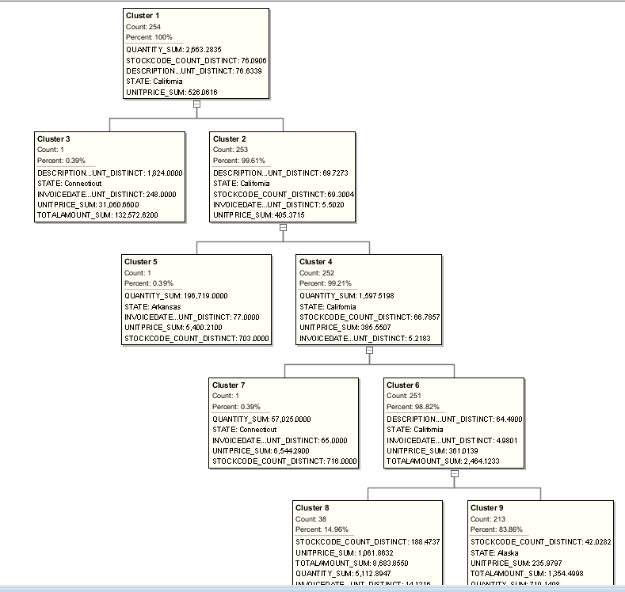 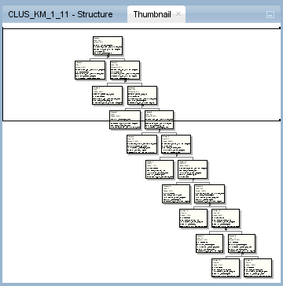

With ODM you cannot change, alter, merge, split, etc. any of the clusters that were generated. 

To see that the cluster rules are for each cluster you can click on a cluster. When you do this you should get a pane (under the cluster diagram) that will contain two tabs, Centroid and Cluster Rule.

The Centroid tab provides a list of the attributes that best define the selected cluster, along with the average value for each attribute and some basic statistical information.

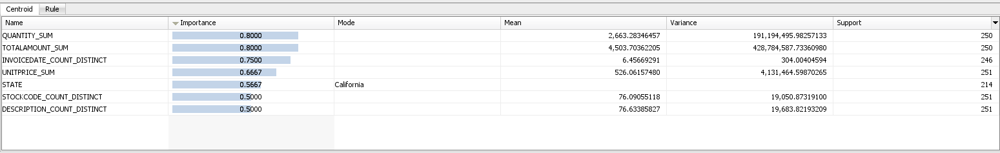  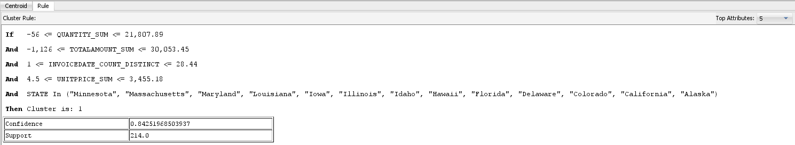
 
For each cluster in the tree we can see the number of cases in each cluster the percentage of overall cases for this cluster. Work your way down the tree exploring each of the clusters produced.

The further down the tree you go the smaller the percentage of cases will fall into each cluster.

## **Step 7:** Compare Clusters
In addition to the cluster tree, ODM also has two addition tabs to allow us to explore the clusters. These are Cluster and Compare tabs.

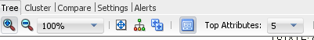

Click on the Cluster tab. We now get a detailed screen that contain various statistical information for each attribute. We can for each attribute get a histogram of the values within each attribute for this cluster.

We can use this important to start building up a picture of what each cluster might represent based on the values (and their distribution) for each cluster.

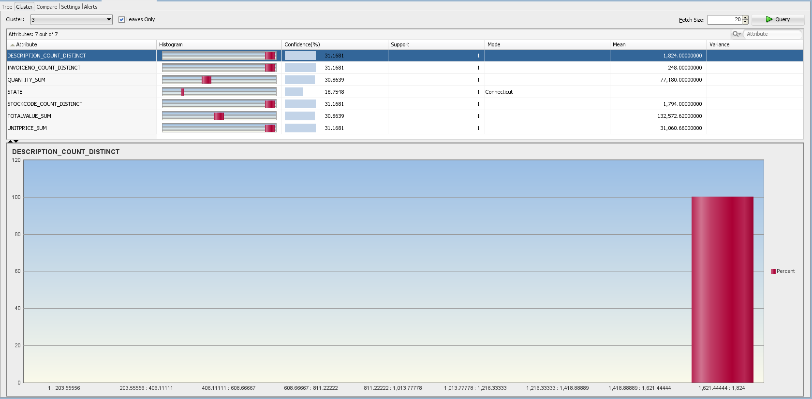
 
## **Step 8:** Multi-Cluster – Multi-variable Comparison of Clusters
The next level of comparison and evaluation of the clusters can be found under the Compare tab.
This lets us compare two clusters against each other at an attribute level. For example, let us compare cluster 3 and 11. The attribute and graphics section is updated to reflect the data for each of cluster. These are color coded to distinguish the two clusters.

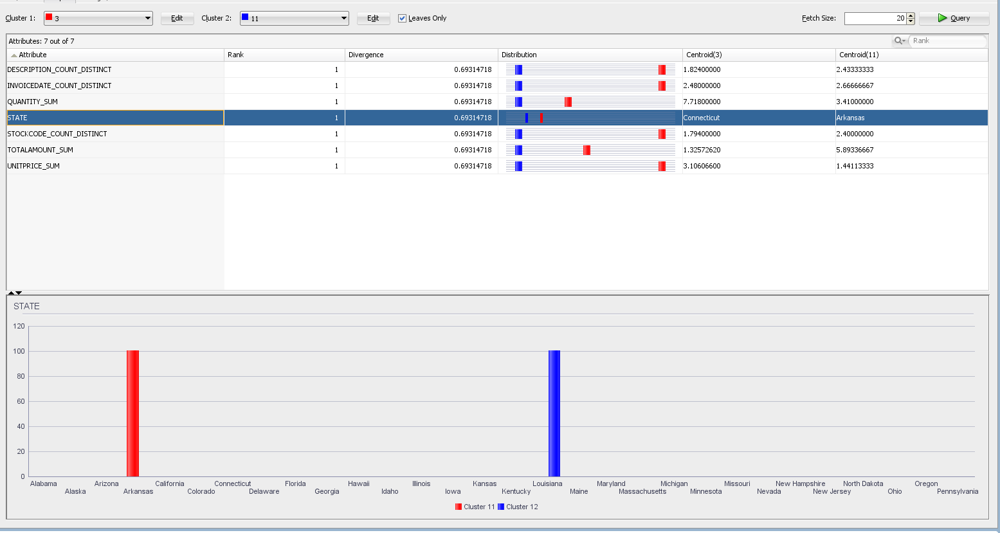
 
We can work our way down through each attribute and again we can use this information to help us to understand what each cluster might represent.

An additional feature here is that we can do multi-variable (attribute) comparison. Holding down the control button select STATE, UNITPRICE\_SUM and QUANTITY\_SUM. With each selection, we get a new graph appearing at the bottom of the screen. This shows the distribution of the values by attribute for each cluster.  We can learn a lot from this.

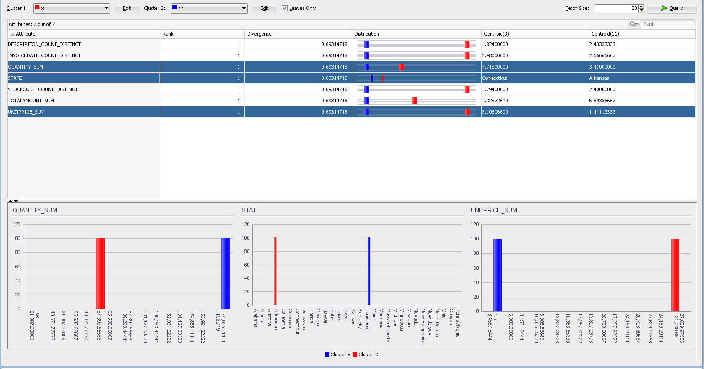

So one possible conclusion we could draw from this data would be that Cluster 3 has customers from Arkansas and Cluster 11 has customers only from Louisiana.

## **Step 9:** Renaming Clusters
When you have discovered a possible meaning for a Cluster, you can give it a meaningful name instead of it having a number. In our example, we would like to re-label Cluster 3 to ‘Arkansas Customers’. To do this click on the Edit button that is beside the drop down that has cluster 3. Enter the new label and click OK.

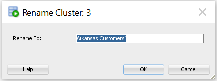
 
In the drop down, we will now get the new label appearing instead of the cluster number.

Similarly, we can do this for the other cluster **e.g. ‘Louisiana Customer’**.

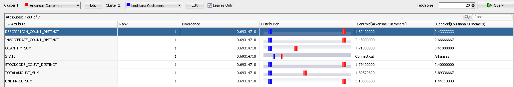
 
We have just looked at how to explore our **K-Means** model. You can do similar exploration of the **O-Cluster** and **EM** (**expectation maximization**) model.
We have now explored our clusters and we have decided which of our Clustering Models best suits our needs. In our scenario, we are going to select the **K-Mean** model to apply and label our new data.

## **Step 10:** Create the Apply Node
We have already setup our sample of data that we are going to use as our Apply Data Set. We did this when we setup the two different Sample node.

We are going to use the Sample node that was set to 40%.

The first step requires us to create an Apply Node. This is under the Model Operations tab, in the components panel. Click on the Apply node, move the mouse to the workflow worksheet and click near the Sample Apply node.

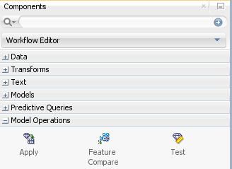 
 
To connect the two nodes, move the mouse to the Sample Apply node and right click. Select Connect from the drop down menu and then move the mouse to the Apply node and click again. A connection arrow appears joining these nodes.

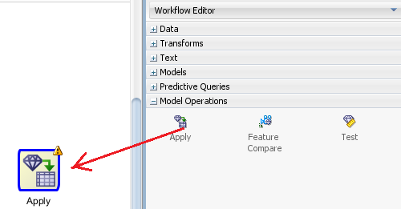 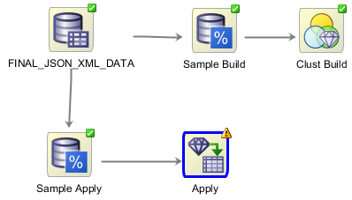
             
## **Step 11:** Specify the Clustering Model to use & Output Data
Now we will select the clustering model we want to apply to our new data.

We need to connect the **Cluster Build** node to the **Apply** node. Move the mouse to the Cluster Build node; **right click** and select connect from the drop down menu. Move the mouse to the **Apply** node and click. We get the connection arrow between the two nodes.

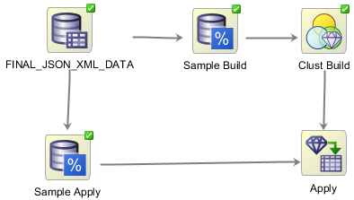
 
The final step is to specify what clustering mode we would like to use. In our scenario, we are going to specify the K-Mean model.

(Single) Click the Cluster Build node. We now need to use the Property Inspector to select the K-Means model for the apply set. 

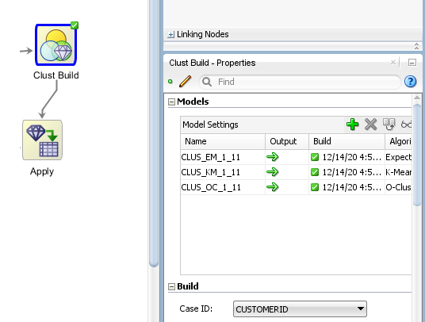
 
In the Models tab of the Property Inspector, we should have our three cluster models listed. Under the Output column click in the box for the O-Cluster and EM Cluster, model. We should now get a little red ‘x’ mark appearing. The K-Mean model should still have the green arrow under the Output column.

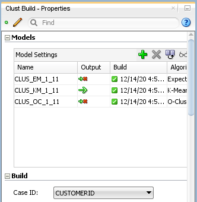
 

## **Step 12:** Run the Apply Node
We have one last data setup to do on the Apply node. We need to specify what data from the apply data set we want to include in the output from the Apply node.  For simplicity, we will include the primary key, but you could include all the attributes.  In addition to including the attributes from the apply data source, the Apply Node will also create some attributes based on the Cluster model we selected. In our scenario, the K-Means model will create two additional attributes. One of these will contain the Cluster ID and the other attribute will be the probability of the cluster being valid.

To include the attributes from the source data, double click on the Apply node. This will open the Edit Apply Node window. You will see that it already contains the two attributes that will be created by the K-Mean model.

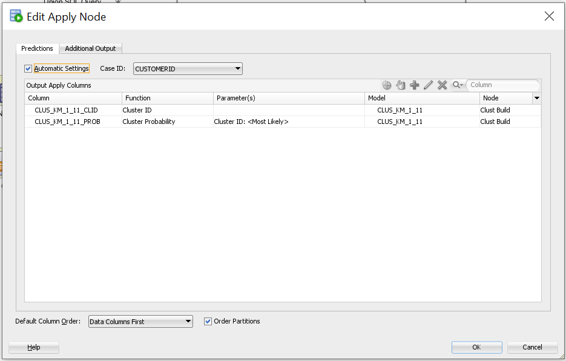
 
To add the attributes from the source data, click on the **Additional Output tab**, click in the **reset** option and then click on the green **‘+’** symbol. For simplicity, just select the CUSTOMERID. Click the OK button to finish.

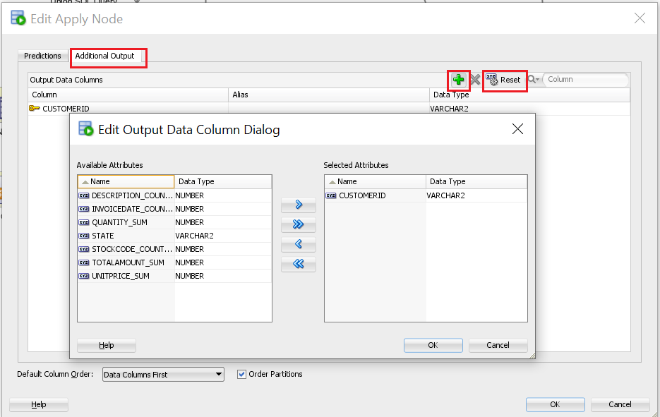
 
Now we are ready to run the Apply node. To do this right click on the Apply Node and select Run from the drop down menu.

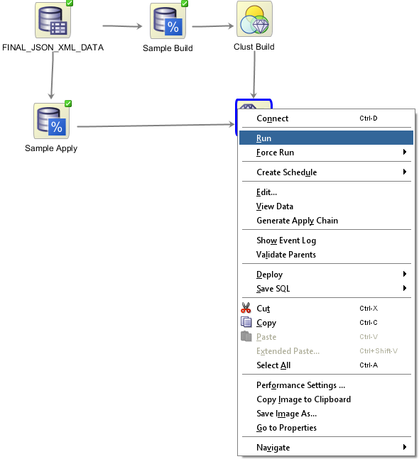
 
When everything is completed, you will get the little green tick mark on the top right hand corner of the Apply node.

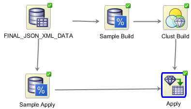
 
## **Step 13:** View the Results
To view the results and the output produced by the Apply node, right click on the Apply node and select View Data from the drop down menu.

We get a new tab opened in SQL Developer that will contain the data. This will consist of the CUSTOMERID, the K-means Cluster ID and the Cluster Probability. You will see that the some of the clusters assigned will have a number and some will have the cluster labels that we assigned in a previous step.

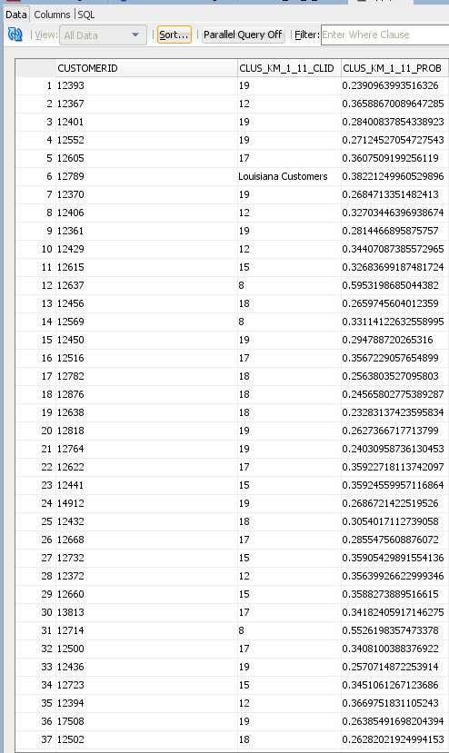
 
It is now up to you to decide how you are going to use this clustering information in an operational or strategic way in your organization.

## **Summary**
In this workshop, you examined and solved a "Clustering" data mining business problem by using the Oracle Data Miner graphical user interface, which is included as an extension to SQL Developer.

In this tutorial, you have learned how to:

  -  Identify Data Miner interface components
  - Create a Data Miner project
  - Build a Workflow document that uses Clustering models for market research to segment the customers based  on their choice and preference.

